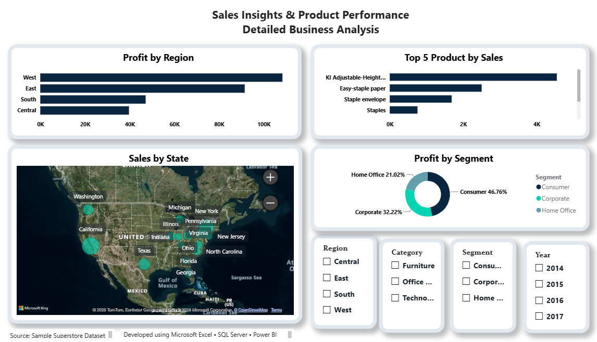

# 📊 Sales Performance Analytics Dashboard

## 📌 Project Overview

This project presents an end-to-end Sales Performance Analytics solution developed using **Microsoft Excel**, **SQL Server (SSMS)**, and **Power BI**. The objective was to transform raw sales data into meaningful business insights through data cleaning, SQL analysis, and interactive dashboard design.

---

## 🛠️ Tools & Technologies

- Microsoft Excel
- SQL Server (SSMS)
- SQL
- Power BI

---

## 📂 Project Workflow

1. Cleaned and validated the sales dataset using Microsoft Excel.
2. Imported the dataset into SQL Server (SSMS).
3. Performed SQL queries to analyze business performance and calculate KPIs.
4. Built an interactive two-page Power BI dashboard.
5. Created visualizations to support business decision-making.

---

## 📈 Dashboard Features

### 📄 Page 1 – Executive Dashboard

- Total Sales
- Total Profit
- Total Orders
- Total Customers
- Monthly Sales Trend
- Sales by Category
- Sales by Region
- Sales by Segment
- Profit by Category

### 📄 Page 2 – Sales Insights

- Profit by Region
- Top 5 Products by Sales
- Sales by State Map
- Interactive Slicers (Region, Category, Segment, Year)

---

## 📊 Key Business Insights

- Technology generated the highest sales revenue.
- The West region achieved the highest overall sales.
- Technology was the most profitable product category.
- Consumer was the largest customer segment.
- Interactive filters allow users to analyze sales across different business dimensions.

---

## 📷 Dashboard Preview

### Executive Dashboard


### Sales Insights



---

## 📁 Repository Structure

```text
sales-performance-analytics-dashboard/
│
├── README.md
├── Sales_Performance_Dashboard.pbix
├── SQL_Queries.sql
├── Dataset/
│   └── Sample_Superstore.csv
└── Dashboard_Screenshots/
    ├── Executive_Dashboard.png
    └── Sales_Insights.png
```

---

## 🚀 Skills Demonstrated

- Data Cleaning
- SQL Query Writing
- KPI Analysis
- Data Visualization
- Dashboard Development
- Business Intelligence
- Data Storytelling

---

## 👩‍💻 Author

**Sharanya M.R.**

If you found this project useful, feel free to ⭐ this repository.
